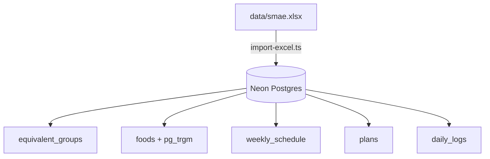

# Implementation Plan: $0 SMAE Diet Agent on Eve (`eve dev`)

Build a personal diet-tracking AI agent powered by Vercel's **Eve** framework (`npx eve dev`), operating on a strictly **$0 stack** using **Groq** (`llama-3.3-70b-versatile`), **Neon Serverless Postgres** (`pg_trgm`), and **Drizzle ORM** to enforce Mexican SMAE (*Sistema Mexicano de Alimentos Equivalentes*) clinical guidelines.

## User Review Required

> [!IMPORTANT]
> **Prerequisites Checklist**:
> 1. `GROQ_API_KEY`: Free-tier API key from [console.groq.com](https://console.groq.com).
> 2. `DATABASE_URL`: Connection string from a free Neon Postgres project ([neon.tech](https://neon.tech)).
> 3. `data/smae.xlsx`: Reference dataset is already in place.

> [!NOTE]
> **$0 Eve Dev Workflow**:
> Eve is a filesystem-first agent framework. Running `npx eve dev` spawns an interactive local terminal/web UI for immediate testing without deploying or setting up custom chat frontends.

---

## Architecture & Proposed Changes

### Component 1: Database & Seed Layer (`agent/db/`)



#### [NEW] `agent/db/schema.ts`
Drizzle ORM schema defining:
- `equivalent_groups`: SMAE baseline macro targets (Verduras, Frutas, Cereal s/grasa, Cereal c/grasa, Leguminosas, AOA muy bajo/bajo/mod/alto grasa, Leche desc/semidesc/entera/azúcar, Grasas, Azúcares).
- `foods`: Food items with `grams_per_equivalent`, `name`, `group_id`, full macros per 100g, `source` (`excel` | `user`), and `pg_trgm` index for fuzzy name search.
- `weekly_schedule`: Day-of-week mapping (`monday`..`sunday`) to active `plan_name`.
- `plans`: Meal-level equivalent breakdown (`plan_name`, `meal`, `group_id`, `equivalentes`).
- `daily_logs`: Consumed food intake (`log_date`, `meal_type`, `food_id`, `grams`, `computed_equivalentes`, `computed_macros`).

#### [NEW] `agent/db/client.ts`
Neon serverless connection pool using `@neondatabase/serverless` and `drizzle-orm/neon-serverless`.

#### [NEW] `agent/db/import-excel.ts`
Idempotent seed script reading `data/smae.xlsx` via `xlsx` to populate `equivalent_groups` and 4,000+ catalog `foods`.

---

### Component 2: Deterministic Pure TypeScript Tools (`agent/tools/`)

All arithmetic is executed deterministically in pure TypeScript with Zod validation (0 LLM math hallucinations).

#### [NEW] `agent/tools/getPlanPortions.ts`
- **Signature**: `(planName?: string, meal?: string, date?: string)`
- **Behavior**: Resolves active plan (using `weekly_schedule` if `planName` omitted) and returns planned equivalents per group.

#### [NEW] `agent/tools/getGramsForPortion.ts`
- **Signature**: `(foodName: string, nEquivalentes?: number)`
- **Behavior**: Fuzzy searches `foods` via `pg_trgm`, returns net grams to fulfill portion.

#### [NEW] `agent/tools/logNutritionFacts.ts`
- **Signature**: `(foodName: string, protein100g: number, fat100g: number, carbs100g: number)`
- **Behavior**: Solves composite equivalents using canonical SMAE priority (15g CHO = 1 eq Cereal, 7g Prot = 1 eq AOA, 5g Lip = 1 eq Grasa) and upserts food with `source = 'user'`.

#### [NEW] `agent/tools/coverageForAmount.ts`
- **Signature**: `(foodName: string, grams: number)`
- **Behavior**: Calculates exact fractional equivalents and macronutrients covered by specified grams.

#### [NEW] `agent/tools/logFood.ts`
- **Signature**: `(date: string, meal: string, foodName: string, grams: number)`
- **Behavior**: Persists intake in `daily_logs` in strict grams, computing covered equivalents and macros.

#### [NEW] `agent/tools/getDailySummary.ts`
- **Signature**: `(date: string, meal?: string)`
- **Behavior**: Aggregates logged intake vs. scheduled target plan, producing a diff of consumed vs. remaining equivalents.

---

### Component 3: Eve Agent Configuration & Instructions (`agent/`)

#### [NEW] `agent/agent.ts`
Configures Eve runtime with Groq model provider (`llama-3.3-70b-versatile` via `@ai-sdk/groq`).

#### [NEW] `agent/instructions.md`
Agent system prompt defining:
- Mexican Spanish bilingual tone.
- SMAE domain terminology enforcement (Equivalente, Tiempo de comida, Grupo).
- Strict tool-routing guidelines (always defer calculation to tools).

---

## Verification Plan

### Automated Tests (Vitest)
```bash
npm run test
```
1. `tests/tools/logNutritionFacts.test.ts`: Verify composite decomposition math (15g CHO / 7g Prot / 5g Lip).
2. `tests/tools/coverageForAmount.test.ts`: Verify exact grams-to-equivalents ratio calculations.
3. `tests/tools/getDailySummary.test.ts`: Verify intake rollup and plan diffing calculations.
4. `tests/db/import-excel.test.ts`: Verify idempotency and row counts from `data/smae.xlsx`.

### Manual End-to-End Verification (`npx eve dev`)
1. Run `npx eve dev` locally.
2. Ask: *"¿Cuáles son mis porciones para el almuerzo del plan leg day?"* $\rightarrow$ verifies `getPlanPortions`.
3. Ask: *"¿Cuántos gramos de pechuga de pollo asada cubren 2 equivalentes?"* $\rightarrow$ verifies `getGramsForPortion`.
4. Log intake: *"Registra 150g de pechuga de pollo y 100g de arroz en la comida de hoy"* $\rightarrow$ verifies `logFood`.
5. Check summary: *"¿Cómo voy hoy contra mi plan?"* $\rightarrow$ verifies `getDailySummary`.
