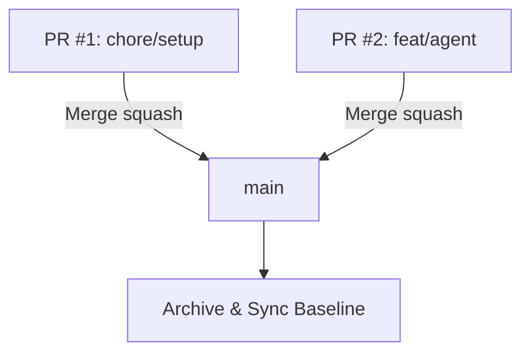

# Implementation Plan: Merge PRs & Execute `/sdd-archive`

Execute the final phase of the SDD lifecycle for `smae-diet-agent`: merge open Pull Requests to `main`, archive the change record, and promote the newly created specs to the living repository baseline `openspec/specs/`.

## User Review Required

> [!IMPORTANT]
> **Merge Sequence Confirmation**:
> 1. Merge PR #1: `chore/CCH/initial-setup-project-context`
> 2. Merge PR #2: `feature/CCH/fa-01-smae-diet-agent`
> 3. Both PRs will be squashed and merged into `main` using GitHub CLI (`gh pr merge --squash`).

---

## Proposed Changes

### Component 1: Git Branches & PR Merges



1. Merge PR #1 ([#1](https://github.com/cesarchavezcal/food-agent/pull/1)) into `main`.
2. Merge PR #2 ([#2](https://github.com/cesarchavezcal/food-agent/pull/2)) into `main`.
3. Switch local workspace back to `main` and pull latest.

---

### Component 2: SDD Archival & Baseline Promotion (`openspec/`)

#### [NEW] `openspec/specs/catalog/spec.md`
Promoted living baseline specification for the SMAE Excel seed parser and fuzzy food search.

#### [NEW] `openspec/specs/calculator/spec.md`
Promoted living baseline specification for deterministic TypeScript portion math, composite solver (15g CHO / 7g Prot / 5g Lip), and in-memory LRU caching.

#### [NEW] `openspec/specs/tracking/spec.md`
Promoted living baseline specification for meal planning, day schedule auto-resolution, intake logging in grams, and daily summary diffing.

#### [NEW] `openspec/specs/agent/spec.md`
Promoted living baseline specification for Vercel Eve agent runtime and Groq model integration.

#### [NEW] `openspec/changes/archive/2026-08-17-smae-diet-agent/`
Archived snapshot containing:
- `proposal.md`
- `design.md`
- `tasks.md`
- `verify-report.md`

#### [DELETE] `openspec/changes/smae-diet-agent/`
Cleaned up active change folder post-archival.

---

### Component 3: Planning Documents Cleanup

- Rename completed planning files with `✅_` prefix in `docs/planning/` per global agent rules:
  - `docs/planning/eve_smae_agent_plan.md` $\rightarrow$ `docs/planning/✅_eve_smae_agent_plan.md`
  - `docs/planning/agent-plan.md` $\rightarrow$ `docs/planning/✅_agent-plan.md`

---

## Verification Plan

### Automated Verification
```bash
git status
npm run test
npm run typecheck
```
- Confirm `main` branch is clean, up to date with `origin/main`, and all 18 tests continue passing.

### Living Specs Validation
```bash
ls -la openspec/specs/
ls -la openspec/changes/archive/
```
- Verify all 4 spec domains exist in `openspec/specs/` and the change is archived in `openspec/changes/archive/2026-08-17-smae-diet-agent/`.
