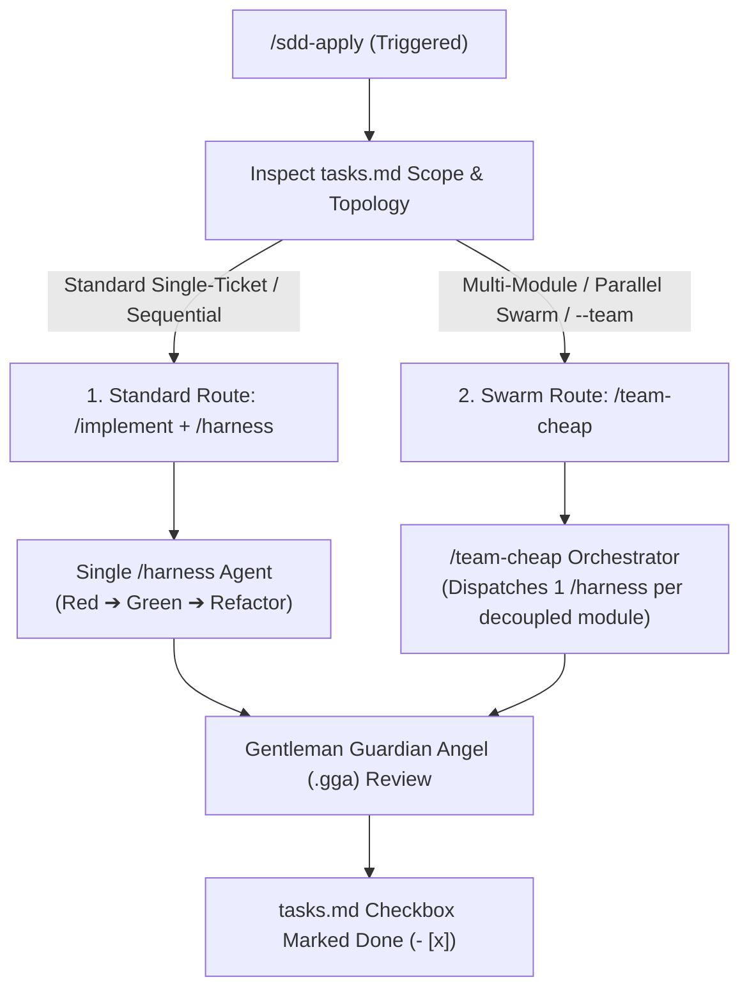

# Implementation Plan: Execution Routing for `/sdd-apply`

A technical specification of how **`/sdd-apply`** orchestrates **`/implement`**, **`/harness`**, and **`/team-cheap`** during feature implementation.

---

## 1. Execution Routing Architecture

When you run `/sdd-apply`, the orchestrator inspects `tasks.md` and delegates execution based on task topology:

---

## 2. Decision Matrix: When is Each Skill Used?

| Scenario | Execution Route | Underlying Skills Used | Behavior |
|---|---|---|---|
| **Standard Feature / Bug / Sequential Task** | **Default Route** | `/implement` `/harness` | Dispatches a dedicated, isolated subagent running `/harness` to write failing tests, implement minimal code, and refactor. |
| **Large Decoupled Feature / Multi-Module / Swarm** | **Parallel Swarm Route** | `/team-cheap` `/harness` | `/team-cheap` fans out isolated background subagents across independent modules, each running `/harness`, and gathers results. |
| **Direct Ticket Execution** | **Direct Ticket Route** | `/implement` | When running `/implement <ticket-id>`, it directly launches `/harness` on that specific task unit. |

---

## 3. How the Skills Collaborate

1. **`/sdd-apply` (The Phase Controller)**:
   - Maintains the SDD state machine.
   - Reads `openspec/changes/<change>/tasks.md`.
   - Tracks completed (`- [x]`) vs pending (`- [ ]`) units.
2. **`/implement` (The Execution Protocol)**:
   - Governs the developer rules: strict typing, clean architecture, error handling.
   - Invokes `/harness` with exact ticket requirements and test criteria.
3. **`/harness` (The Autonomous Worker)**:
   - The bounded single-ticket worker:
     - Step 1: Write failing test (Red).
     - Step 2: Implement code to pass test (Green).
     - Step 3: Clean up and refactor (Refactor).
     - Step 4: Verify against `.gga` review rules.
4. **`/team-cheap` (The Swarm Orchestrator)**:
   - Used when tasks are marked as parallelizable or when `--team` is specified.
   - Dispatches one isolated `/harness` agent per independent domain module.

---

## 4. Proposed Updates in Repository

### 1. Update [`AGENTS.md`](file:///Users/cesaradalbertochavezcalderon/Personal/agent-boilerplate/AGENTS.md)
#### [MODIFY] [`AGENTS.md`](file:///Users/cesaradalbertochavezcalderon/Personal/agent-boilerplate/AGENTS.md)
- Formalize the `/sdd-apply` routing policy:
  - Default: `/sdd-apply` executes tasks test-first via `/implement` + `/harness`.
  - Swarm: `/sdd-apply --team` executes parallel tasks via `/team-cheap`.

### 2. Update [`openspec/config.yaml`](file:///Users/cesaradalbertochavezcalderon/Personal/agent-boilerplate/openspec/config.yaml)
#### [MODIFY] [`openspec/config.yaml`](file:///Users/cesaradalbertochavezcalderon/Personal/agent-boilerplate/openspec/config.yaml)
- Configure `apply` phase executor bindings to `/implement`, `/harness`, and `/team-cheap`.

---

## 5. Verification Plan

### Automated / Command Verification
1. Inspect [`AGENTS.md`](file:///Users/cesaradalbertochavezcalderon/Personal/agent-boilerplate/AGENTS.md) and [`openspec/config.yaml`](file:///Users/cesaradalbertochavezcalderon/Personal/agent-boilerplate/openspec/config.yaml) for clear routing rules.

### Manual Verification
- Verify that invoking `/sdd-apply` seamlessly leverages `/implement` and `/harness` without requiring manual subagent plumbing.
