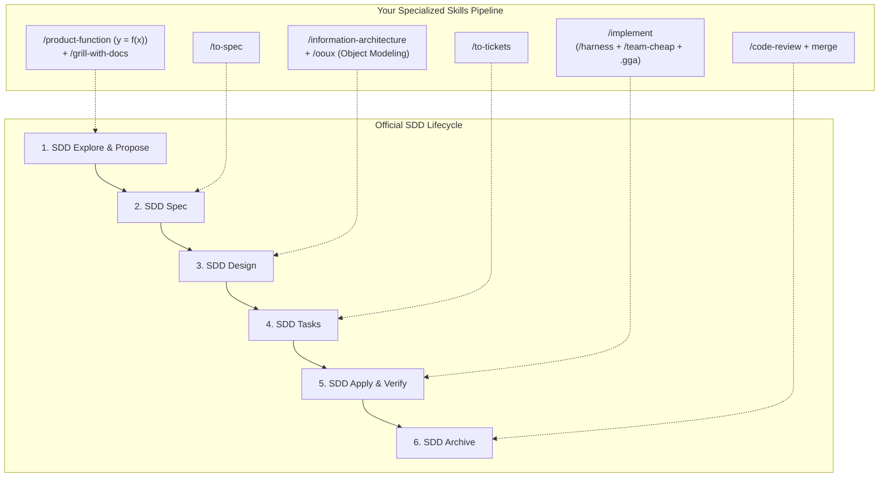

# Implementation Plan: Unifying Existing 7-Step Pipeline with SDD

Integrate the existing 7-step product design and execution sequence (`/product-function` ➔ `/grill-with-docs` ➔ `/to-spec` ➔ `/ia` ➔ `/ooux` ➔ `/to-tickets` ➔ `/implement`) with the official **SDD (Spec-Driven Development)** lifecycle and OpenSpec artifact standard.

---

## Analysis & Architectural Synthesis

### Do you need to remove skills?
**No.** All 41 remaining installed skills are active, specialized tools. Your existing pipeline skills provide domain-specific depth ($y = f(x)$ functional scoping, Socratic grilling, OOUX object modeling, information architecture, autonomous subagent swarms) that elevate standard SDD specifications into production-grade systems.

### Do you need to add new skills?
**No.** The orchestrator already has access to global `/sdd-*` phase skills (`sdd-init`, `sdd-explore`, `sdd-propose`, `sdd-spec`, `sdd-design`, `sdd-tasks`, `sdd-apply`, `sdd-verify`, `sdd-archive`).

### Do you need to link them?
**Yes.** We will formalize the **Unified SDD + 7-Step Architecture Pipeline** in [`AGENTS.md`](file:///Users/cesaradalbertochavezcalderon/Personal/agent-boilerplate/AGENTS.md) and [`openspec/config.yaml`](file:///Users/cesaradalbertochavezcalderon/Personal/agent-boilerplate/openspec/config.yaml) so that running either high-level SDD phases or specific pipeline commands produces unified OpenSpec artifacts.

---

## The Unified SDD Pipeline Mapping

### Phase-by-Phase Integration Matrix

| SDD Phase | Your Pipeline Commands | Artifacts Produced & Location | Purpose / Superpower |
|---|---|---|---|
| **Phase 1: Explore & Propose** | `/product-function` `/grill-with-docs` `/sdd-explore` | `docs/product-design/product_function.md` `openspec/changes/<change>/proposal.md` | Strips 10x scope creep ($y=f(x)$) and stress-tests constraints against docs before writing specs. |
| **Phase 2: Specification** | `/to-spec` `/sdd-spec` | `openspec/specs/<feature>/spec.md` `docs/product-design/spec.md` | Formal requirements, domain contracts, and acceptance criteria. |
| **Phase 3: Architecture & Design** | `/information-architecture` `/ooux` `/sdd-design` | `docs/product-design/ia.md` `docs/product-design/ooux.md` `openspec/changes/<change>/design.md` | Sitemaps, user sequence flows, real-world object cards, ERDs, and deep module boundaries. |
| **Phase 4: Task Decomposition** | `/to-tickets` `/sdd-tasks` | `openspec/changes/<change>/tasks.md` | Test-first, red-green-refactor atomic ticket breakdown. |
| **Phase 5: Apply & Verify** | `/implement` `/tdd` `/harness` `/team-cheap` | Working source code + unit/integration tests | Autonomous subagent execution adhering to GGA review rules. |
| **Phase 6: Verification & Archive** | `/code-review` `/sdd-verify` `/sdd-archive` | `openspec/changes/archive/` Git PR + merged changes | Quality gate enforcement (.gga + two-axis review) and spec syncing. |

---

## Proposed Changes

### 1. Update [`AGENTS.md`](file:///Users/cesaradalbertochavezcalderon/Personal/agent-boilerplate/AGENTS.md)
#### [MODIFY] [`AGENTS.md`](file:///Users/cesaradalbertochavezcalderon/Personal/agent-boilerplate/AGENTS.md)
- Update Section 2 to document the **Unified SDD + 7-Step Pipeline Sequence**, showing exact skill mappings, artifact targets (`openspec/` + `docs/product-design/`), and how slash commands interoperate seamlessly.

### 2. Update [`openspec/config.yaml`](file:///Users/cesaradalbertochavezcalderon/Personal/agent-boilerplate/openspec/config.yaml)
#### [MODIFY] [`openspec/config.yaml`](file:///Users/cesaradalbertochavezcalderon/Personal/agent-boilerplate/openspec/config.yaml)
- Link the pipeline stages in `openspec/config.yaml` to the specialized skill triggers (`/product-function`, `/ooux`, `/harness`, etc.).

---

## Verification Plan

### Automated / Command Verification
1. Verify [`AGENTS.md`](file:///Users/cesaradalbertochavezcalderon/Personal/agent-boilerplate/AGENTS.md) contains the unified mapping diagram and clear execution instructions.
2. Verify [`openspec/config.yaml`](file:///Users/cesaradalbertochavezcalderon/Personal/agent-boilerplate/openspec/config.yaml) syntax and stage linkage.
3. Validate that `.atl/skill-registry.md` matches the referenced skills.

### Manual Verification
- Review the unified workflow steps to ensure natural developer ergonomics when triggering either `/sdd-*` commands or specific pipeline skills.
