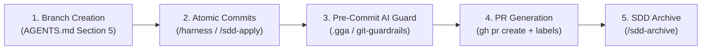

# Implementation Plan: Git Automation Across SDD & Skills Lifecycle

A technical explanation of how Git operations (branching, committing, PR creation, and archiving) are handled within the Spec-Driven Development (SDD) lifecycle and specialized skills.

---

## 1. Git Automation Mapping Across Phases

In this boilerplate, Git operations are embedded natively at each phase of the lifecycle:

| Lifecycle Stage | Primary Tool / Skill | Git Action Performed | Automated Rule / Convention |
|---|---|---|---|
| **1. Branch Creation** | Orchestrator / `/init-project` | `git checkout -b {branch}` | Enforces `{prefix}/CCH/{project-initials}-{ticket}-{summary}` naming format. |
| **2. Atomic Task Commits** | `/harness` / `/sdd-apply` | `git add` & `git commit` | Commits changes per task using Conventional Commits (`feat(...)`, `fix(...)`, `chore(...)`). |
| **3. Safety & Review Gate** | `.gga` & `git-guardrails` | Pre-commit hook inspection | Blocks commits violating Section 6 coding rules; blocks destructive commands (`push -f`, `reset --hard`). |
| **4. Pull Request Creation** | Git Workflow (`gh pr create`) | `git push` & `gh pr create` | Generates concise 2–4 sentence PR description and automatically attaches preview app labels. |
| **5. Change Archiving & Merge** | **`/sdd-archive`** | Moves change to `archive/` & updates `openspec/specs/` | Synchronizes living specifications and marks change as complete in Git. |

---

## 2. The Terminal SDD Phase: `/sdd-archive`

The canonical SDD skill for finalizing Git and spec work is **`/sdd-archive`**:
- Moves `openspec/changes/<change>/` to `openspec/changes/archive/<date>-<change>/`.
- Merges change deltas into the living `openspec/specs/<feature>/spec.md`.
- Prepares the branch for merging into `main`.

---

## 3. Dedicated Git Safety Skills in Workspace

- **[`git-guardrails-claude-code`](file:///Users/cesaradalbertochavezcalderon/Personal/agent-boilerplate/.agents/skills/git-guardrails-claude-code/SKILL.md)**: Prevents accidental destructive git operations (`git clean -fd`, `git reset --hard`, `git push --force`).
- **[`.gga`](file:///Users/cesaradalbertochavezcalderon/Personal/agent-boilerplate/.gga)**: Pre-commit AI hook evaluating diffs against `AGENTS.md`.
- **[`resolving-merge-conflicts`](file:///Users/cesaradalbertochavezcalderon/Personal/agent-boilerplate/.agents/skills/resolving-merge-conflicts/SKILL.md)**: Specialized skill for structured conflict resolution during rebases or merges.

---

## 4. Proposed Action Plan

Execute the baseline setup commit for `agent-boilerplate`:
1. Verify git identity (`cesarchavezcal`).
2. Create baseline setup branch: `chore/CCH/initial-setup-complete`.
3. Stage and commit all template assets.

---

## 5. Verification Plan

### Automated / Command Verification
- Check `git branch` and `git log -1` to confirm conventional commit formatting and clean working directory.
