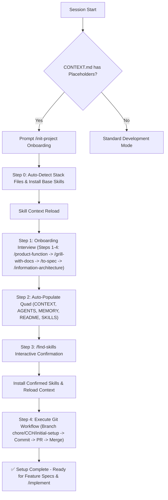

# Implementation Plan: Automated Project Initializer & Onboarding Flow

This plan establishes an automated initial project setup flow for `agent-boilerplate`. When an agent session starts in a fresh repository derived from this template, the agent will automatically detect uninitialized state and run an onboarding setup flow aligned with the **Official 7-Step Pipeline Sequence**. It also embeds strict **Branch Naming, Git Workflow Lifecycle, Conventional Commits, and PR Guidelines** in [`AGENTS.md`](file:///Users/cesaradalbertochavezcalderon/Personal/agent-boilerplate/AGENTS.md) and adds a default [`.github/PULL_REQUEST_TEMPLATE.md`](file:///Users/cesaradalbertochavezcalderon/Personal/agent-boilerplate/.github/PULL_REQUEST_TEMPLATE.md).

---

## User Review Required

> [!IMPORTANT]
> **Rule Active Status & Immediate Execution Flow**
> The Git Workflow rule is defined in this plan and will become **permanently active in `AGENTS.md` as soon as you approve execution**.
> 
> To follow the rule immediately during this execution turn:
> 1. **Branch Creation**: The agent will immediately create branch `chore/CCH/initial-setup-project-automation`.
> 2. **File Modifications**: Edit [`AGENTS.md`](file:///Users/cesaradalbertochavezcalderon/Personal/agent-boilerplate/AGENTS.md) (adding Section 5), create [`.github/PULL_REQUEST_TEMPLATE.md`](file:///Users/cesaradalbertochavezcalderon/Personal/agent-boilerplate/.github/PULL_REQUEST_TEMPLATE.md), create [`scripts/setup-project.sh`](file:///Users/cesaradalbertochavezcalderon/Personal/agent-boilerplate/scripts/setup-project.sh), and update [`SKILLS.md`](file:///Users/cesaradalbertochavezcalderon/Personal/agent-boilerplate/SKILLS.md), [`CONTEXT.md`](file:///Users/cesaradalbertochavezcalderon/Personal/agent-boilerplate/CONTEXT.md), [`README.md`](file:///Users/cesaradalbertochavezcalderon/Personal/agent-boilerplate/README.md).
> 3. **Commit & Push**: Commit with Conventional Commit (`chore(setup): configure initial project onboarding and git rules`) and push branch.
> 4. **Pull Request**: Open PR following the PR guidelines.

---

## Open Questions

> [!NOTE]
> None. Ready to execute upon approval.

---

## Proposed Changes

### Configuration & Documentation Quad

#### [MODIFY] [AGENTS.md](file:///Users/cesaradalbertochavezcalderon/Personal/agent-boilerplate/AGENTS.md)
- Add **Session-Start Auto-Detection Rule**:
  - Inspect `CONTEXT.md` for placeholder values (`[Your Project Name]`).
  - Prompt user to run `/init-project`.
- Add **`/init-project` Slash Command & Workflow Definition**:
  - Step 0: Auto-detect stack files + Base Skills installation (`npx skills@latest add mattpocock/skills`) + skill reload.
  - Step 1: Onboarding interview (Steps 1–4: `/product-function` -> `/grill-with-docs` -> `/to-spec` -> `/information-architecture`).
  - Step 2: Quad document auto-population (`CONTEXT.md`, `AGENTS.md`, `MEMORY.md`, `README.md`, `SKILLS.md`).
  - Step 3: Interactive `/find-skills` discovery & confirmation + skill reload.
  - Step 4: Git workflow completion (create branch `chore/CCH/initial-setup-project`, commit, push PR).
- Add **Section 5: Mandatory Git Workflow Lifecycle, Branch Naming, Commit & PR Conventions**:
  - Mandatory Workflow: `Branch` -> `Changes & Commit` -> `Push & PR` -> `Merge into Base Branch`
  - Initial Setup Branch: `chore/CCH/initial-setup-{summary}`
  - Feature / Fix Branch: `{prefix}/CCH/{project-initials}-{ticket-number}-{ticket-summary}`
  - Conventional Commits: `<prefix>(<scope>): 
`
  - PR Principles & Label checks

#### [NEW] [.github/PULL_REQUEST_TEMPLATE.md](file:///Users/cesaradalbertochavezcalderon/Personal/agent-boilerplate/.github/PULL_REQUEST_TEMPLATE.md)
- Add standardized PR template.

#### [MODIFY] [SKILLS.md](file:///Users/cesaradalbertochavezcalderon/Personal/agent-boilerplate/SKILLS.md)
- Register `init-project` skill and base package (`mattpocock/skills`, `personal-skills`).

#### [MODIFY] [CONTEXT.md](file:///Users/cesaradalbertochavezcalderon/Personal/agent-boilerplate/CONTEXT.md)
- Format placeholder tags for robust automated replacement.

#### [MODIFY] [README.md](file:///Users/cesaradalbertochavezcalderon/Personal/agent-boilerplate/README.md)
- Update onboarding instructions to feature the automated `/init-project` setup flow and git workflow lifecycle.

---

### Automation Scripts & Helper Tools

#### [NEW] [scripts/setup-project.sh](file:///Users/cesaradalbertochavezcalderon/Personal/agent-boilerplate/scripts/setup-project.sh)
- Shell script helper for:
  - Stack file auto-detection (`package.json`, etc.)
  - Base skill installation (`npx skills@latest add mattpocock/skills -g -y`)
  - Skill search and execution check

---

## Workflow Sequence Details

---

## Verification Plan

### Automated Verification
- Run `bash scripts/setup-project.sh --check` to test script execution.
- Validate markdown formatting across updated `.md` quad files and `.github/PULL_REQUEST_TEMPLATE.md`.

### Manual Verification
- Test placeholder detection and execute `/init-project` workflow simulation.
