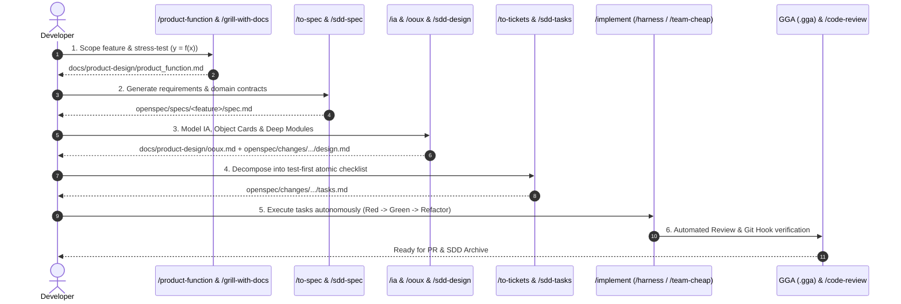

# Implementation Plan: Unified SDD & Skills Workflow Guide

A comprehensive architectural and developer guide explaining how your 41 specialized skills work collaboratively within the Spec-Driven Development (SDD) lifecycle.

---

## 1. End-to-End Operational Lifecycle

When you want to build a feature, fix a bug, or refactor a module, you have **two ways to interact with the system**:
1. **High-Level SDD Trigger**: Run `/sdd-explore`, `/sdd-propose`, `/sdd-spec`, etc.
2. **Specific Skills Trigger**: Run `/product-function`, `/ooux`, `/harness`, etc.

Both triggers follow the **same unified pipeline** and write to standardized directories (`openspec/` and `docs/product-design/`).

---

## 2. Step-by-Step Practical Walkthrough

### Step 1: Scope & Stress-Test (Phase 1 — Explore & Propose)
- **Skills Used**: `/product-function`, `/grill-with-docs`, `/sdd-explore`
- **What Happens**:
  - Eliminates scope creep by defining the problem strictly as $y = f(x)$ ($x$ = initial state, $y$ = target state, $f(x)$ = minimal transformation).
  - Socratic grilling stress-tests edge cases against documentation before writing any code.
- **Output Artifacts**:
  - `docs/product-design/product_function.md`
  - `openspec/changes/<feature-slug>/proposal.md`

---

### Step 2: Formal Specification (Phase 2 — Spec)
- **Skills Used**: `/to-spec`, `/sdd-spec`
- **What Happens**:
  - Converts the approved $y=f(x)$ scope into formal acceptance criteria, typed input/output schemas, and state invariants.
- **Output Artifacts**:
  - `openspec/specs/<feature-slug>/spec.md`

---

### Step 3: Architecture & Object Modeling (Phase 3 — Design)
- **Skills Used**: `/information-architecture`, `/ooux`, `/codebase-design`, `/sdd-design`
- **What Happens**:
  - `/information-architecture`: Establishes sitemaps, user flows, and taxonomy.
  - `/ooux`: Defines real-world domain objects, core attributes, metadata cards, and ERDs.
  - `/codebase-design`: Defines deep module seams (simple public interfaces hiding internal complexity).
- **Output Artifacts**:
  - `docs/product-design/ia.md`
  - `docs/product-design/ooux.md`
  - `openspec/changes/<feature-slug>/design.md`

---

### Step 4: Task Decomposition (Phase 4 — Tasks)
- **Skills Used**: `/to-tickets`, `/sdd-tasks`
- **What Happens**:
  - Breaks the design down into atomic, test-first tickets.
  - Each task defines: (1) Failing test, (2) Minimal implementation, (3) Refactoring and interface verification.
- **Output Artifacts**:
  - `openspec/changes/<feature-slug>/tasks.md`

---

### Step 5: Autonomous Test-First Implementation (Phase 5 — Apply)
- **Skills Used**: `/implement`, `/tdd`, `/harness`, `/team-cheap`
- **What Happens**:
  - `/harness` runs isolated subagents to execute `tasks.md` step-by-step.
  - If multiple modules/repos are involved, `/team-cheap` fans out parallel subagents to complete tasks.
  - Strictly follows TDD (Red ➔ Green ➔ Refactor) and modular architecture principles from `AGENTS.md`.
- **Output Artifacts**:
  - Clean, tested source code on a dedicated branch (`feature/CCH/...`).

---

### Step 6: Automated Quality Gate & Archiving (Phase 6 — Verify & Archive)
- **Skills Used**: Gentleman Guardian Angel (`.gga`), `/code-review`, `/sdd-verify`, `/sdd-archive`
- **What Happens**:
  - `.gga` evaluates pre-commit diffs against `AGENTS.md` coding standards using Gemini.
  - `/code-review` conducts a two-axis review (Standards compliance + Spec compliance).
  - OpenSpec change is archived into `openspec/changes/archive/`.
- **Output Artifacts**:
  - Git PR opened via `gh pr create` with matching labels.
  - `openspec/changes/archive/<date>-<feature-slug>/`

---

## 3. Proposed Updates to Codify This in Repository

### 1. Update [`AGENTS.md`](file:///Users/cesaradalbertochavezcalderon/Personal/agent-boilerplate/AGENTS.md)
#### [MODIFY] [`AGENTS.md`](file:///Users/cesaradalbertochavezcalderon/Personal/agent-boilerplate/AGENTS.md)
- Embed this explicit step-by-step unified mapping in Section 2, replacing the legacy placeholder text with the exact skill orchestration guide.

### 2. Update [`openspec/config.yaml`](file:///Users/cesaradalbertochavezcalderon/Personal/agent-boilerplate/openspec/config.yaml)
#### [MODIFY] [`openspec/config.yaml`](file:///Users/cesaradalbertochavezcalderon/Personal/agent-boilerplate/openspec/config.yaml)
- Link OpenSpec phases to the corresponding skill commands.

---

## 4. Verification Plan

### Automated / Command Verification
1. Inspect [`AGENTS.md`](file:///Users/cesaradalbertochavezcalderon/Personal/agent-boilerplate/AGENTS.md) to confirm all 6 unified phases and commands are documented.
2. Verify YAML syntax of [`openspec/config.yaml`](file:///Users/cesaradalbertochavezcalderon/Personal/agent-boilerplate/openspec/config.yaml).

### Manual Verification
- Validate that invoking either `/product-function` or `/sdd-new` guides the developer through this structured pipeline without ambiguity.
