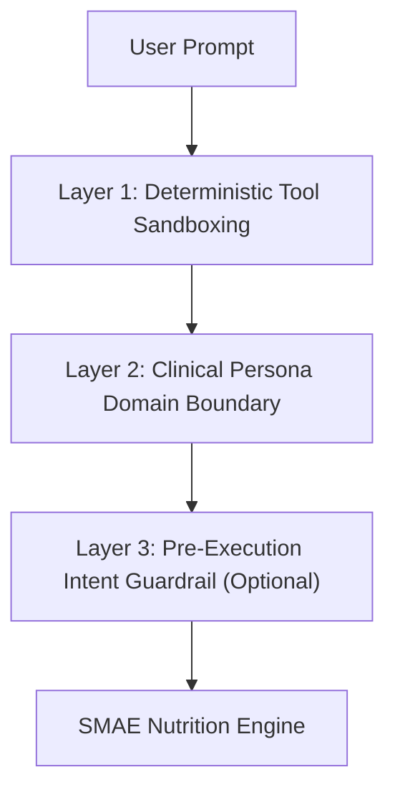

# Exploration: Agent Security, Off-Topic Guardrails, and Scope Enforcement

## Problem Statement

Users may attempt off-topic prompts (e.g. general math like "$100 - $50", coding, general trivia, finance) or prompt injections to use the agent for unintended purposes, consuming free-tier LLM quota or generating inappropriate responses.

---

## Architectural Defense-in-Depth Model



---

## Defense Layers & Approaches

### 1. Tool Sandboxing (Already Enforced)
- **Mechanism**: The agent is provided with **zero generic execution tools** (no eval, no bash, no general calculator, no internet search).
- **Security Impact**: The agent is physically incapable of performing unauthorized state mutations or calculations outside the SMAE domain.

---

### 2. System Instructions Boundary & Strict Rejection Policy (Recommended)
- **Mechanism**: Define explicit out-of-scope policies in `agent/instructions.md`:
  ```markdown
  ### Scope & Boundary Constraints
  - You are strictly a clinical nutrition and SMAE diet agent.
  - You must NEVER answer questions unrelated to nutrition, meal planning, food intake, body composition, or SMAE calculations (e.g., general mathematics, coding, finance, politics, unrelated chit-chat).
  - When an out-of-scope prompt is detected, politely decline and re-anchor to nutrition:
    "I am your clinical nutrition assistant. I can only assist with diet tracking, meal planning, and SMAE food calculations. How can I assist with your nutrition today?"
  ```
- **Pros**: 0ms latency, $0 cost, natural conversational tone.
- **Cons**: Soft boundary (LLM-enforced).

---

### 3. Lightweight Semantic / Regex Intent Pre-Filter (Optional Hard Gate)
- **Mechanism**: A fast TypeScript guard in `agent/cli.ts` / middleware checking for basic off-topic patterns or using Groq's `meta-llama/llama-prompt-guard-2-86m`.
- **Pros**: Drops malicious or irrelevant requests before invoking the main 70B/120B model.
- **Cons**: Adds small complexity and risk of false negatives.

---

## Recommendation

Implement a **Two-Tier Guardrail Strategy**:
1. **Strict Rejection Policy in `agent/instructions.md`**: Enforce that the agent immediately rejects any non-nutrition question with a standard professional refusal and re-anchors to diet tracking.
2. **Tool Sandboxing**: Ensure tools only accept strictly validated nutrition payloads via Zod schemas.

---

## Verification Strategy

Add automated tests in `tests/agent/guardrails.test.ts` verifying:
- "How much is 100 - 50?" $\rightarrow$ Agent refuses and redirects to nutrition.
- "Write me a Python script" $\rightarrow$ Agent refuses and redirects to nutrition.
- "How many grams is 1 equivalent of chicken?" $\rightarrow$ Agent executes `getGramsForPortion` and answers accurately.
