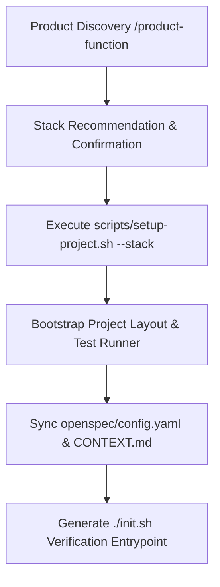

# Architecture & Design: Flexible Stack Scaffolding & Config Sync

## Architecture Overview

## Component Architecture

1. **Stack Scaffolder (`scripts/setup-project.sh`)**:
   - Supports modular stack flags: `--stack node-ts`, `--stack python-fastapi`, `--stack go`, `--stack rust`.
   - Idempotently creates starter directory structure without touching `.agents/` or SDD configurations.
2. **Config Synchronizer**:
   - Automatically writes `runner`, `test_command`, and `lint_command` into `openspec/config.yaml`.
   - Regenerates `./init.sh` with exact project commands (`set -e`, test, lint, typecheck).
3. **Harness Integration**:
   - Links test runner commands directly to `init.sh` for instant verification during `/sdd-apply` and `/harness`.
